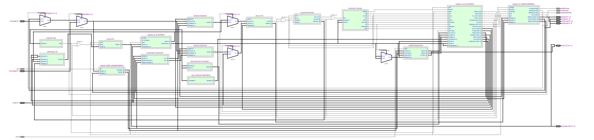

# AUEB 16-bit processor

### Description

The following project is a set of three assignments aiming to design a 16-bit processor using [Altera Quartus II](https://www.intel.com/content/www/us/en/collections/products/fpga/software/downloads.html?s=Newest). It also constitutes the mandatory assignment for the semester class of Computer Architecture. Each assignment creates some unique components of the processor. In addition, the final assignment composes all the previously-made parts to one single component; the processor.

For referrence, below is an image of the processor to be made.

### Assignments

* [First assignment](docs/first.md)
* [Second assignment](docs/second.md)
* [Third assignment](docs/third.md)
