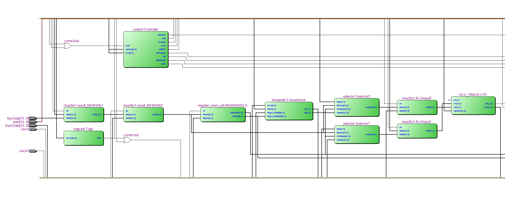

# Third assignment

## Short description

The goal of the third part is to design and create a RISC pipelined CPU. Some parts of the first and second assignments are in use here. Moreover, this assignment may utilize behavioural-style VHDL, unlike the first part which ought to be completed using structural VHDL code only. Finally, after creating more components, the entire CPU is assembled.

## Components

* **Forwarder**: Responsible for forwarding unsaved data to the next CPU cycle.
* **Selector**: Decides the first value of the ALU.
* **Controller**: Controls the sequence of command execution by setting all necessary signals.
* **Hazard unit**: Initiates a flush.
* **Trap unit**: Monitors the *opcode* of every command and forces the system to flush when an *End of Running* is received.
* **Register IFID**: Receives and returns the *program counter* and the *instruction* to the ALU.
* **Register IDEX**: Re-routes data to either the ALU or the EXMEM register, depending the instruction's type.
* **Register MEMWB**: Receives the data to be written from either the keyboard or the memory and sends them to the register file.
* **JR selector**: Selects the jump address.
* **PC register**: Contains the program counter and calculates the next one when needed.

## Final product

A 16-bit CPU is the final product of this assignment. The CPU follows the RISC architecture and is able to perform basic operations such as addition, multiplication and more.

## Screenshots

The controller's RTL diagram

The RTL diagram of the MEMWB register

The PC register's functional waveform diagram

The processor's input and components up until the ALU

The continuation of the previous screenshots. Here the processor's central components are being depicted

The output and final two registers of the processor in an RTL diagram
